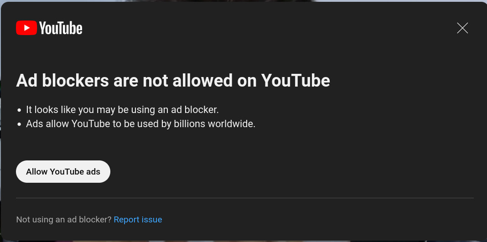
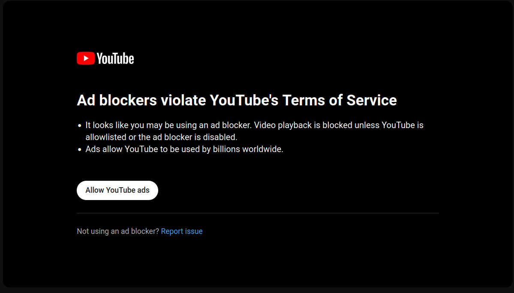
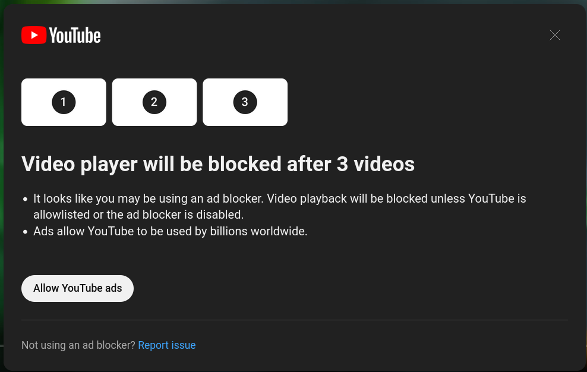

  

# YT Siphon
### Redirect YouTube URLs to Alternative Frontends Manually

**YT Siphon** is a browser extension that lets you choose to open YouTube videos in alternative frontends. Instead of auto-redirecting, it gives you the power to decide with simple shortcuts.
**Key Features**:
- **`Alt+J`**: Open the current YouTube video in your chosen frontend.
  - *Tip*: You can customize this shortcut in your browser settings.
- **`Shift+Click`**: While on YouTube, use this to open a video (by clicking on thumbnails / links) in the configured frontend in a new tab.

Perfect for those who like to browse the YouTube homepage and selectively watch videos on alternative frontends. Also handy if someone shares a YouTube link with you and you prefer watching it on a different frontend.

## Motivation
YouTube started cracking down on Ad Blocker usage, so this is my workaround.

## Installation

### Mozilla Add-Ons site
[Get the add-on from addons.mozilla.org](https://addons.mozilla.org/en-US/firefox/addon/yt-siphon/)

### Manual
1. Download the `.xpi` addon file from the [Releases page](https://github.com/d3vr/yt-siphon/releases/)
2. Go to `about:addons`
3. Click the gear icon and select `Install Add-on From File`

### Cloned repo
1. Clone the repository or download as zip
2. Go to `about:debugging`
3. Click on `This Firefox`
4. Then `Load Temporary Add-on`
5. Select `manifest.json` in the `src/` directory from the cloned repo.

## Configuration
1. Visit YouTube then click the Add-Ons icon to open the panel and click the gear icon next to `YT Siphon`
2. Select `Always Allow on www.youtube.com`
3. ...
4. Profit?

You can change the default configured alternative frontend (`piped.video`) from the options page. You can click the extension's icon to access the options page.

## Credit
- GPT-4 and [Phind](https://www.phind.com/) helped a lot while creating this add-on.
- DALL-E 3 created the logo / icon.

## License
[MIT](https://www.tldrlegal.com/license/mit-license)
